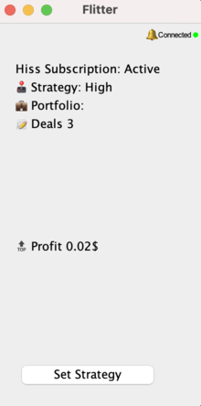
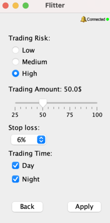

# FlitterApplication: Cryptocurrency Trading Application 

## 🍀Description

`FlitterApplication` is a desktop application developed in Java using Spring Boot and Swing for automated cryptocurrency trading.

## 🚨 Disclaimer

This software is provided "as-is" without any warranties or guarantees. Users should be aware that trading cryptocurrencies is risky and should use this software at their own risk. The developer are not responsible for any financial losses or other damages incurred.

## 🌟 Key Features

- [x] 🔒 Secure API connectivity to exchange
- [x] 📊 Getting data from HISS analytical service
- [x] 📈 Interface for real-time monitoring
- [x] 📚 Trade history and analytical tools

## 🛠 Technologies

- Java
- Swing
- Spring Boot
- RESTful API

## 📸 Screenshots

### Main Screen


### Strategy


## 💾 Installation

1. Clone the repository
    ```bash
    git clone https://github.com/berstainmark/FlitterApplication.git
    ```
2. Navigate to the project directory
    ```bash
    cd FlitterApplication
    ```
3. Build the project
    ```bash
    mvn clean install
    ```
4. Run the application
    ```bash
    java -jar target/Flitter-1.0.0.jar
    ```

## ⚙ Configuration

You can set the following parameters in the `application.properties` file:

- `websocket.url` — url for the data stream
- `app.home` — home directory

## 📖 Usage Examples

After launching the application:

1. Enter your API key and secret key in the respective fields
2. Select the trading strategy from the drop-down list
3. Press the "Strategy" button to commence trading

## 📝 License

This project is licensed under the MIT License. The software is distributed under a free license, allowing for modification, redistribution, and personal or commercial use. 


